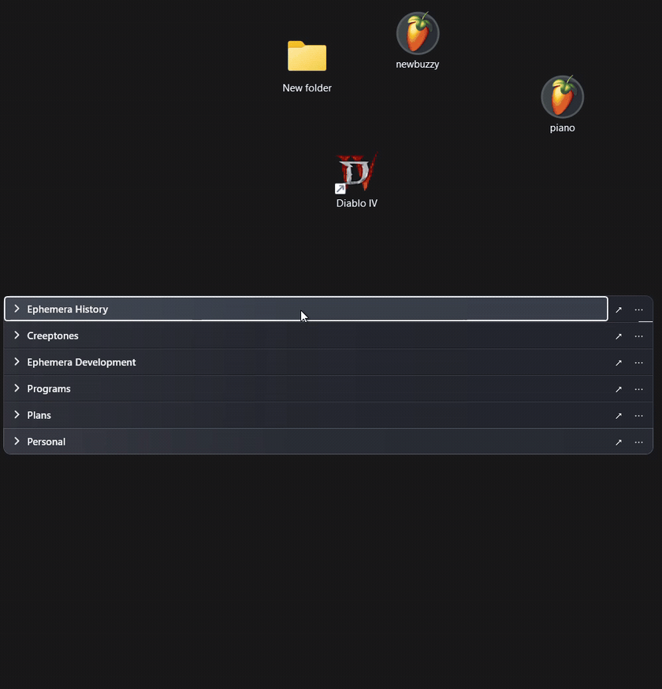

# Pickets

[](https://github.com/Creeptones/Pickets/actions/workflows/build.yml)
[](LICENSE)
[](#requirements)

**A tidy desktop, with your files right where you left them.**

Pickets organizes files, folders, and shortcuts into movable desktop groups. Collapse them
into a compact stack, find what you need, and expand a section with one click.
Free and open source. No accounts, ads, or telemetry.



[View a still screenshot](docs/images/pickets-desktop.png)

[Downloads](https://github.com/Creeptones/Pickets/releases) ·
[User guide](docs/USER_GUIDE.md) ·
[Report a bug](https://github.com/Creeptones/Pickets/issues)

## Get started

1. Get **PicketsSetup.exe** from [Releases](https://github.com/Creeptones/Pickets/releases)
   for a guided install, or **Pickets.exe** for portable use. Neither needs admin access or a
   separate .NET installation.
2. Follow the first-run guide. In **Desktop → right-click → View**, turn off
   **Auto arrange icons** and **Align icons to grid**.
3. Drag desktop icons into a picket, or open its **⋯ → Add…** menu to add files and folders.

Downloads are currently unsigned. For SmartScreen and checksum guidance, see
[Verifying a download](docs/USER_GUIDE.md#verifying-a-download).
[Update and uninstall instructions](docs/USER_GUIDE.md#updating) are in the guide too.

## What you can do

- **Keep groups compact:** snapping, connected stacks, optional one-section-at-a-time mode,
  and automatic height up to two icon rows.
- **Organize in batches:** rectangle selection, bulk actions, and dragging several items together.
- **Find and undo:** search the current layout with **Ctrl+F**; undo supported organizing actions
  with **Ctrl+Z** (up to 30 actions per session).
- **Make it yours:** ten color themes, subtle gradients, transparency, optional blur, and large icons.
- **Use your setup:** layouts for different monitor arrangements, keyboard controls,
  and Windows high-contrast support.

Pickets stores references to individual files and folders. Adding a folder creates a reference
to it; it does not show a live view of that folder's contents.

## Everyday controls

| To… | Do this |
| --- | --- |
| Open an item | Double-click it |
| Expand or collapse a picket | Click its title, or press **Space** with the title focused |
| Move a connected stack | Drag a title bar |
| Select several items | Drag a rectangle from empty space inside a picket |
| Remove selected references | Press **Delete** — original files stay untouched |
| Find a reference / undo an action | **Ctrl+F** / **Ctrl+Z** while Pickets is focused |
| Show or hide Pickets | Use the tray icon or double-click empty desktop space |
| Focus Pickets | **Ctrl+Alt+D** by default |

Press **F1** for keyboard help. See the [user guide](docs/USER_GUIDE.md#using-pickets)
for stacking, resizing, selection modifiers, and all shortcuts.

## Your files and recovery

Pickets never moves or deletes your original files. Dragging a desktop icon in hides its desktop
presentation; removing it or choosing **Quit Pickets** restores it. Adding through **Add…** leaves
any desktop icon visible. Layouts and logs stay in `%APPDATA%\Pickets`.

If Pickets cannot start and captured icons remain hidden, run this from its executable folder:

```powershell
.\Pickets.exe --restore-icons
```

This permanently releases captured icons across saved layouts.
[Recovery and local data](docs/USER_GUIDE.md#local-data-and-recovery) ·
[Troubleshooting](docs/USER_GUIDE.md#troubleshooting) ·
[Privacy details](docs/USER_GUIDE.md#privacy-and-security)

## Requirements

Windows 10 version 1809 or newer, or Windows 11; **x64** downloads.
The two desktop arrangement options above must be off.
Building from source requires Windows and the **.NET 10 SDK**.

## Contribute

[Bug reports and focused pull requests](https://github.com/Creeptones/Pickets/issues) are welcome.
Include steps to reproduce and use **About Pickets → Copy diagnostics** for a redacted summary.
Review any logs or screenshots for private paths before sharing.

[Build instructions](docs/BUILDING.md) · [Changelog](CHANGELOG.md) ·
[Release checklist](docs/RELEASE_CHECKLIST.md) · [Security policy](SECURITY.md)

[MIT License](LICENSE).
